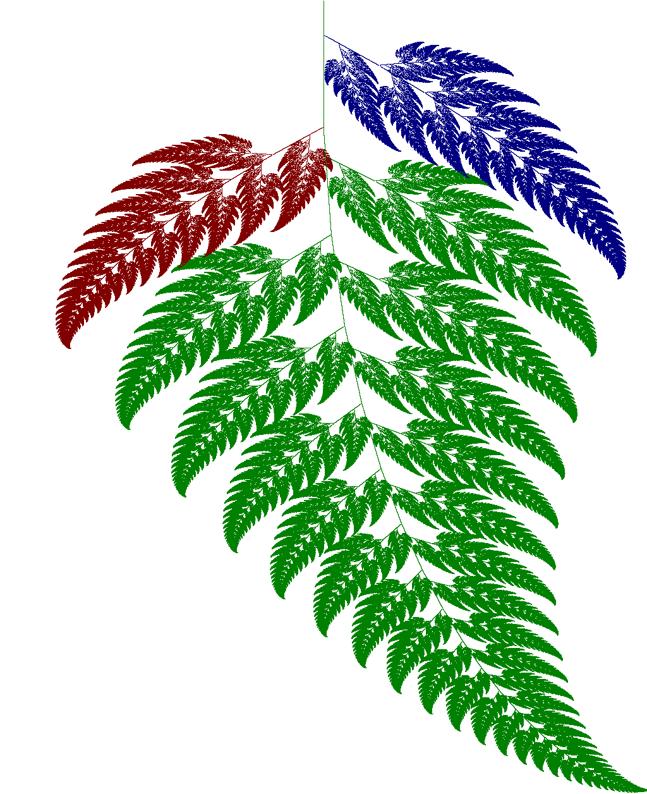

# An implementation of the Barnsley Fern fractal algorithm in Go
Check out [https://en.wikipedia.org/wiki/Barnsley_fern](https://en.wikipedia.org/wiki/Barnsley_fern) for details.



Run it with:
```shell
$ go run main.go > mynewfractal.png
```

Or use it in your own Go program, say to produce a gif, with:
```go
package main

import (
	"github.com/mikebharris/barnsley/fern"
	"image/gif"
	"os"
)

func main() {
	gif.Encode(os.Stdout, fern.GenerateBarnsleyFern(240, 320, 100000), nil)
}
```
